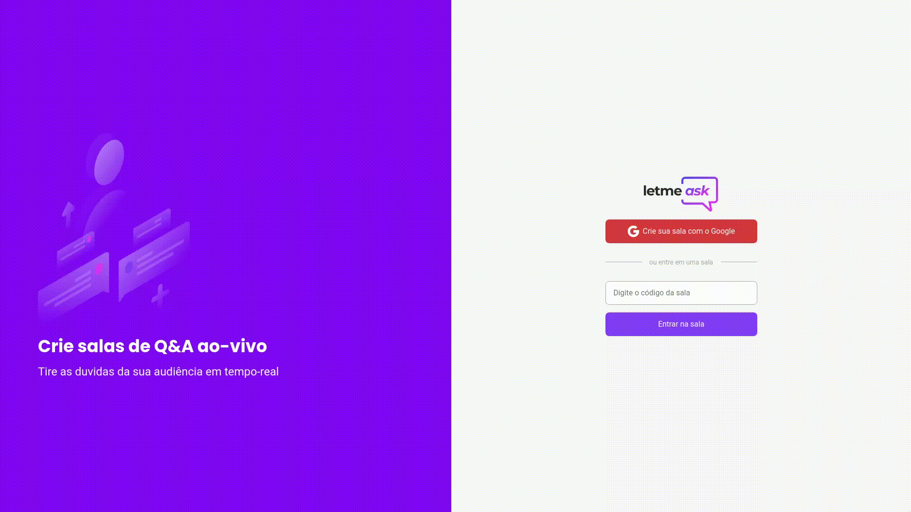

<h1 align="center" display="flex" justify-content="center">
  
</h1>

  

 
 
 

## ❓ **Sobre**

Projeto desenvolvido durante a NLW-06, evento oferecido pela [Rocketseat 🚀](https://blog.rocketseat.com.br/primeira-next-level-week/).
Se trata de uma plataforma de Q&A em tempo real. Você pode criar uma sala,
e compartilhar o código de acesso com outros usuários. Projeto realizado
para adquirir conhecimentos na biblioteca React.js e no serviço Firebase.

 

## 💻 **Tecnologias**

- **[React](https://reactjs.org/)**
- **[Typescript](https://www.typescriptlang.org/)**
- **[Firebase](https://firebase.google.com/)**

 

---

  Licença MIT. Por: João Moschetta, oferecido por Rocketseat.

